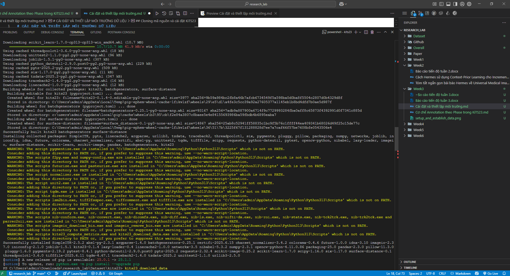
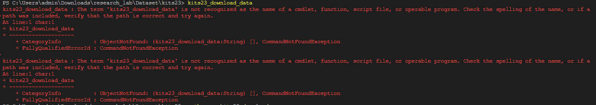
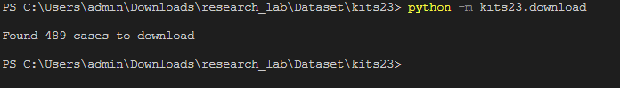

# CÀI ĐẶT VÀ THIẾT LẬP MÔI TRƯỜNG DỮ LIỆU

## Cloning mã nguồn và cài đặt KiTS23

- Clone kho lưu trữ mã nguồn chính thức từ Github:

```
https://github.com/neheller/kits23
```

- Sau đó cài đặt gói kits23 ở chế độ "editable":
```
pip3 install -e .
```

- Điều này tự động cài đặt các thư viện cần thiết như: `nibabel`, `SimpleITK`, `scikit-image`, `opencv-python`, `surface-distance`, v.v.




## Khắc phục lỗi không nhận diện CLI

- Do thư mục cài đặt script (`Scripts/`) không nằm trong biến môi trường PATH, nên lệnh:

```
kits23_download_data
```

- Gây lỗi `CommandNotFoundException`



### Solution

- Gọi trực tiếp bằng Python:

```
python -m kits23.download
```



- Lệnh này tương đương và cho phép bắt đầu quá trình tải dữ liệu về thư mục `dataset/`.

## Kết quả

- Tổng cộng có 489 ca bệnh được liệt kê. Trong quá trình tải:

   - Một số ca (ví dụ `case_00476`) gặp lỗi **mạng hoặc thiếu byte** (ContentTooShortError)

   - Sau đó chạy lại `python -m kits23.download` để tự động retry

- Sau khi hoàn tất, thư mục `dataset/` có cấu trúc chuẩn:

```
dataset/
├── case_00000/
│   ├── imaging.nii.gz
│   ├── segmentation.nii.gz
│   └── instances/
│       ├── kidney_instance-1_annotation-1.nii.gz
│       └── ...
├── case_00001/
│   └── ...

```

- Sẵn sàng để tiền xử lý và xây dựng tập huấn luyện theo từng phase.