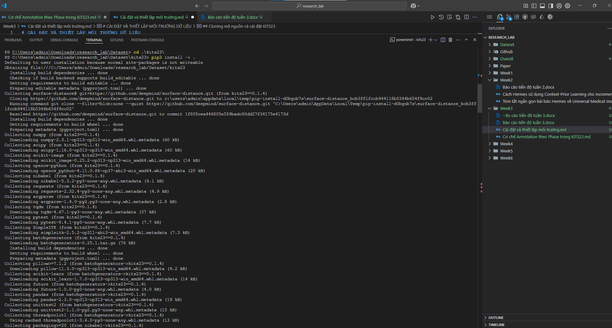

# BÁO CÁO TIẾN ĐỘ – TUẦN 3

**Sinh viên:** Nguyễn Minh Quân  
**MSSV:** 21010617  
**Lớp:** CNTT1  
**Khóa:** K15  
**Ngành:** Công nghệ thông tin  
**Cơ sở thực tập:** IDSAI Lab – Trường CNTT PHENIKAA  

**Thời gian thực tập:** 09/06 – 20/07/2025  
**Báo cáo tuần 3:** 23/06 – 29/06/2025  

---

## NỘI DUNG CÔNG VIỆC

### ✅ Mục tiêu:
Phát triển bộ dữ liệu phù hợp để mô phỏng môi trường Incremental Learning trong phân đoạn ảnh y tế.

### ✅ Kết quả:

#### 1. Tìm hiểu bộ dữ liệu KiTS23
- Phân tích cấu trúc thư mục gồm:
  - `imaging.nii.gz`: ảnh CT gốc
  - `segmentation.nii.gz`: mặt nạ phân đoạn tổng hợp
  - `instances/`: chứa các phân đoạn riêng theo từng instance và phase chú thích (annotation)
- Hiểu rõ cơ chế annotation:
  - `annotation-1`, `annotation-2`, `annotation-3` tương ứng với các annotator khác nhau hoặc các giai đoạn refine
  - Ví dụ:
    - `kidney_instance-1_annotation-1.nii.gz`
    - `tumor_instance-1_annotation-3.nii.gz`

#### 2. Cài đặt và thiết lập môi trường dữ liệu

- Clone mã nguồn chính thức từ Github:
  ```
  https://github.com/neheller/kits23
  ```

- Cài đặt gói `kits23`:
  ```bash
  pip3 install -e .
  ```

- Khắc phục lỗi không gọi được `kits23_download_data`:
  ```bash
  python -m kits23.download
  ```

- Tải thành công gần đủ các `case_xxxxx` vào thư mục `dataset/`



#### 3. Phân tích dữ liệu annotation
- Phân tích cấu trúc tăng dần số lớp theo phase
- Xác định khả năng áp dụng cho học tăng cường:  
  - Phase 1: kidney  
  - Phase 2: thêm tumor  
  - Phase 3: đầy đủ các lớp

#### 4. Lên kế hoạch pipeline huấn luyện theo phase
- Sẽ tạo `dataset.yaml` hoặc `.npy` riêng từng phase
- Dữ liệu đã sẵn sàng để thử nghiệm mô hình Hermes từ tuần sau

---

## ⚠️ VẤN ĐỀ GẶP PHẢI & CÁCH XỬ LÝ

| Vấn đề                                 | Cách xử lý                                |
|----------------------------------------|--------------------------------------------|
| Không chạy được `kits23_download_data`| Dùng `python -m kits23.download`           |
| Mất kết nối khi tải                    | Xóa `case_00476.zip`, retry tự động        |
| Thiếu thư viện `nibabel`               | Cài bằng pip khi cài `kits23`              |

---

## 📌 NHẬN XÉT CỦA GIÁO VIÊN HƯỚNG DẪN

*… (để trống cho GVHD nhận xét) …*
